<p align="center">
  
</p>

<h1 align="center">AXIOM Engine</h1>
<h3 align="center"><em>See Algorithms Think</em></h3>

<p align="center">
  <a href="#getting-started"></a>
  <a href="LICENSE"></a>
  <a href="#api-reference"></a>
  <a href="#self-healing-render-pipeline"></a>
  <a href="#testing"></a>
  <a href="#tech-stack"></a>
  <a href="#architecture"></a>
</p>

<p align="center">
  <strong>An AI-powered interactive algorithm visualization engine</strong> that transforms complex CS concepts into<br/>
  step-by-step simulations with real-time diagram generation, a self-healing render pipeline,<br/>
  semantic caching, RAG document chat, and three distinct AI teaching personas.<br/>
  Built with Flask, Google Gemini 2.5 Pro, FAISS, LangChain, Three.js, and Mermaid.js.
</p>

<br/>

<table align="center">
  <tr>
    <td align="center" width="25%">
      <h3>🧠</h3>
      <strong>AI Simulation Engine</strong><br/>
      <sub>3 personas · streaming generation<br/>7 algorithm categories detected<br/>stateful multi-step continuations</sub>
    </td>
    <td align="center" width="25%">
      <h3>🔧</h3>
      <strong>Self-Healing Pipeline</strong><br/>
      <sub>4-tier escalation system<br/>23+ regex transforms · 13-phase JS sanitizer<br/>auto-repairs ~85% of render failures</sub>
    </td>
    <td align="center" width="25%">
      <h3>📄</h3>
      <strong>RAG Document System</strong><br/>
      <sub>PDF upload → FAISS vector search<br/>768-dim embeddings · top-4 retrieval<br/>context-grounded responses</sub>
    </td>
    <td align="center" width="25%">
      <h3>⚡</h3>
      <strong>Production-Grade Infra</strong><br/>
      <sub>semantic caching · thread-safe sessions<br/>10 SQLite tables · auto-migration<br/>rate limiting · prompt injection defense</sub>
    </td>
  </tr>
</table>

<p align="center">
  
  <br/><em>📸 Demo GIF — coming soon</em>
</p>

---

## Why I Built This

I'm **Daniil** — a CS major at **Northwestern University** (Class of 2027, Systems concentration, Cognitive Science minor). Across multiple classes, I kept hitting the same wall: algorithms made sense in lecture, but the moment I tried to trace through them alone — whether it was backpropagation, Dijkstra's, or a red-black tree rotation — I'd lose track of state by step three. Existing tools were either too static (textbook diagrams), too shallow (simple animations with no explanation), or too rigid (pre-built visualizations for only a handful of algorithms).

I wanted to *see* algorithms think. Not static textbook diagrams, but something I could step through with real data, at my own pace, with an AI that could explain what was happening at every node. Something that could visualize *any* algorithm — not just the ten that someone pre-built. So I built **AXIOM**.

What started as a weekend hack to survive my data structures class evolved into a **10,000+ line full-stack AI application** with a custom syntax repair compiler, production-grade concurrent session management, a two-tier semantic caching system, a complete RAG pipeline, and three AI teaching personas with distinct pedagogical strategies. I'm open-sourcing it so others can learn the way I wish I could have from day one.

> *If you've ever stared at pseudocode wishing it would just show you what's happening — this is for you.*

---

## Table of Contents

- [At a Glance](#at-a-glance)
- [Features](#features)
- [Architecture](#architecture)
- [Tech Stack](#tech-stack)
- [Getting Started](#getting-started)
- [Project Structure](#project-structure)
- [Deep Dive: How It Works](#deep-dive-how-it-works)
  - [Simulation Generation Pipeline](#simulation-generation-pipeline)
  - [Self-Healing Render Pipeline](#self-healing-render-pipeline)
  - [RAG Document Pipeline](#rag-document-pipeline)
  - [Caching & Data Layer](#caching--data-layer)
- [AI Persona System](#ai-persona-system)
- [API Reference](#api-reference)
- [Design Patterns & Engineering Principles](#design-patterns--engineering-principles)
- [Security](#security)
- [Testing](#testing)
- [Performance Characteristics](#performance-characteristics)
- [Engineering Challenges & Solutions](#engineering-challenges--solutions)
- [Roadmap](#roadmap)
- [License](#license)

---

## At a Glance

<table>
  <tr>
    <td>

| Architecture | Metric |
|:-------------|:-------|
| Source Files | **64** across 4 languages |
| REST API Endpoints | **31** across 8 Flask blueprints |
| Frontend Modules | **10** — zero framework dependencies |
| Database Tables | **10** with WAL-mode + auto-migration |
| Dependencies | **22** Python packages |
| Lines of Code | **10,000+** |

  </td>
  <td>

| Intelligence | Metric |
|:-------------|:-------|
| Self-Healing Pipeline | **4-tier** escalation (23+ regex + 13-phase JS) |
| Semantic Cache | **2-tier** (SHA-256 → cosine ≥ 0.80) |
| AI Personas | **3** with independent temperature tuning |
| Prompt Injection Patterns | **11** compiled regex detectors |
| Algorithm Categories | **7** auto-detected with input generation |
| Test Fixtures | **23** across 392 lines of test infra |

  </td>
  </tr>
</table>

---

## Features

### 🧠 AI-Powered Step-by-Step Simulations

AXIOM doesn't just explain algorithms — it *generates interactive, multi-step visual simulations* with real data.

- **Streaming generation** via `generate_content_stream()` — first tokens arrive before full generation completes
- **Structured JSON playlist** output: each step includes a Mermaid flowchart, markdown narrative (200–300 words), an optional data table overlay, and a `step_analysis` object tracking `what_changed`, `previous_state`, `current_state`, and `why_matters`
- **Algorithm-type detection** — automatically identifies 7 algorithm categories (sort, tree, graph, search, DP, linked list, hash) and generates concrete random input data (arrays, adjacency matrices, tree structures)
- **Stateful continuations** — maintains algorithmic correctness across "Generate More" requests by injecting the last 3 graph snapshots + full state history into the LLM context window
- **Three difficulty personas** — Explorer (beginner), Engineer (intermediate), Architect (advanced) — each with distinct tone, complexity, and teaching strategy

<p align="center">
  
  <br/><em>📸 Step-by-step simulation — coming soon</em>
</p>

### 📄 RAG-Powered Document Intelligence

Upload any PDF and AXIOM unlocks two document-aware modes — deep Q&A and document-grounded simulation generation.

- **Dual Document Modes:** `DOCUMENT_QA` for rich, cited answers; `DOCUMENT_SIMULATION` for generating visualizations of algorithms described in your uploaded material
- **Smart Intent Detection:** 41 phrase-based trigger patterns route queries to the correct mode — no accidental misfires
- **PyMuPDF** extraction with page-level metadata preservation
- **RecursiveCharacterTextSplitter** — 1,000-char chunks with 100-char overlap for context continuity
- **768-dimensional dense vectors** via Google `gemini-embedding-001`
- **FAISS `IndexFlatL2`** with top-6 retrieval and **word-level deduplication** (>60% overlap filtering)
- **Persona-specific document prompts** — each AI persona (Explorer/Engineer/Architect) has a tailored document Q&A system prompt with citation rules, formatting guidance, and depth calibration
- Seamless fallback to LLM internal knowledge when no document is uploaded

### 🔧 4-Tier Self-Healing Render Pipeline

Mermaid syntax is fragile. LLMs produce broken diagrams ~30–40% of the time. AXIOM fixes them automatically.

| Tier | Method | Speed | API Cost |
|:-----|:-------|:------|:---------|
| **Tier 1** | Python regex sanitizer (23+ transforms) | ~5ms | Free |
| **Tier 2** | Python + client-side JS sanitizer (13 phases) | ~10ms | Free |
| **Tier 3** | LLM repair + Python sanitizer | ~3–10s | API call |
| **Tier 4** | LLM repair + Python + JS sanitizer | ~3–10s | API call |

Target distribution: **~60% Tier 1** · ~25% Tier 2 · ~15% Tiers 3/4. After all tiers exhaust, displays broken code with a detailed failure view.

> [See the full technical deep dive →](#self-healing-render-pipeline)

### 🗄️ Semantic Caching System

A **cost-optimization layer** that eliminates redundant Gemini API calls:

- **Tier 1 — Exact hash match**: SHA-256 hash of normalized prompt + difficulty → instant retrieval, zero API cost
- **Tier 2 — Semantic similarity**: Generates embedding, searches cached entries for same difficulty, returns best match if cosine similarity ≥ 0.80
- **Broken simulation tracking**: Retry budget (max 3), 24-hour cooldown between retries, permanent-broken status after exhaustion — prevents wasting API credits on known-bad prompts
- Only **verified-complete** simulations (all steps rendered successfully + client confirmation) are cached

### 🎨 Interactive Visualizations

- **Mermaid flowcharts** with semantic node shapes (stadium, cylinder, diamond, hexagon, etc.) and CSS styling classes (`active`, `data`, `process`, `alert`, `memory`, `io`, `neutral`)
- **Zoom & pan** — mouse wheel zoom toward cursor, click-and-drag pan, auto-centering with exponential backoff SVG dimension detection
- **Clickable node inspection** — clicking any node sends context to the LLM, which generates a tooltip with the node's current value, what changed, and what happens next
- **Draggable data table overlay** — floating panel showing runtime state (variable values, pointers, counters)
- **Step navigation** — Previous / Next / Reset / Generate More controls
- **Graph theme toggle** — light/dark mode per diagram
- **Feedback system** — thumbs up/down on completed simulations (data logged for future ML training)

### 🌌 Three.js Neural Background

A 3,000+ particle system with custom GLSL shaders:
- Burst → converge → text formation intro ("AXIOM")
- Mouse vortex physics interaction (particles respond to cursor)
- Processing mode with wave pulses during LLM generation
- Celebration particle effects on simulation completion
- Simulated bloom post-processing layer

### 📚 Algorithm Library

Pre-built prompt presets organized by category:

| Category | Examples |
|:---------|:--------|
| **Data Structures & Algorithms** | Linked Lists, Stacks, Queues, Binary Trees, Heaps |
| **Sorting** | QuickSort, MergeSort, HeapSort, Radix Sort |
| **Graph Algorithms** | Dijkstra's, BFS, DFS, Kruskal's, Bellman-Ford |
| **Dynamic Programming** | Knapsack, LCS, Matrix Chain, Coin Change |
| **AI / Machine Learning** | Neural Networks, Backpropagation, Transformers, Attention |
| **Systems** | CPU Pipeline, Memory Hierarchy, TCP/IP, Virtual Memory |
| **Biology & Math** | DNA Replication, Fourier Transform, Gradient Descent |

### 📊 Debug Dashboard

A full analytics dashboard for repair pipeline performance:
- **Chart.js** visualizations of repair tier distribution and success rates
- Filterable repair records with modal inspection
- Trend charts for repair performance over time
- LLM diagnostics viewer for raw output analysis

<p align="center">
  
  <br/><em>📸 Debug dashboard — coming soon</em>
</p>

---

## Architecture


### Request Flow: Chat Query

```mermaid
sequenceDiagram
    participant User
    participant Flask
    participant Validator
    participant Cache
    participant Persona
    participant RAG
    participant Gemini
    participant Sanitizer

    User->>Flask: POST /chat (message + difficulty)
    Flask->>Validator: Rate limit + session check + injection scan
    Validator->>Cache: Check semantic cache (hash → similarity)
    
    alt Cache Hit (≥ 0.80 cosine sim)
        Cache-->>Flask: Return cached simulation
    else Cache Miss
        Cache->>Persona: Select persona (Explorer/Engineer/Architect)
        Persona->>RAG: Retrieve top-4 document chunks (if PDF uploaded)
        RAG->>Gemini: Assembled prompt + streaming request
        Gemini-->>Flask: Stream chunks (token by token)
        Flask->>Sanitizer: Sanitize Mermaid code (23+ regex transforms)
        Flask-->>User: Stream response in real-time
        Note over User,Sanitizer: Client renders → if fail → 4-tier repair escalation
    end
```



---

## Tech Stack

### Backend

| Technology | Version | Purpose |
|:-----------|:--------|:--------|
| **Flask** | ≥ 2.0 | Lightweight web framework — serves API + static files, blueprint architecture |
| **Google Gemini** | 2.5 Pro | LLM for simulation generation, repair, node inspection, prompt enhancement |
| **LangChain** | ≥ 0.2 | RAG pipeline orchestration — document splitting, embedding, retrieval |
| **FAISS** | ≥ 1.8 | Facebook's billion-scale similarity search — chosen over ChromaDB for lower memory footprint and zero server dependency |
| **PyMuPDF** | ≥ 1.24 | PDF text extraction with page-level metadata |
| **SQLite** | WAL mode | Persistent cache, repair logs, diagnostics, ML training data — 10 tables with auto-migration |
| **NumPy + scikit-learn** | — | Cosine similarity computation for semantic cache |
| **Pydantic** | ≥ 2.0 | Runtime data validation and settings management |
| **BeautifulSoup** | — | URL content scraping for web-based document ingestion |
| **Redis** | Alpine | Available via Docker Compose for future scaling |

### Frontend

| Technology | Version | Purpose |
|:-----------|:--------|:--------|
| **Vanilla JavaScript** | ES6+ | 10-file modular IIFE architecture — zero framework dependencies |
| **Mermaid.js** | 11.3.0 | Flowchart/diagram rendering from LLM-generated code |
| **Three.js** | r128 | Animated 3,000+ particle neural background with custom shaders |
| **svg-pan-zoom** | 3.6.1 | SVG zoom and pan interactions on rendered diagrams |
| **marked.js** | — | Markdown → HTML rendering for step narratives |
| **Prism.js** | 1.29.0 | Syntax highlighting for code blocks |
| **Chart.js** | 4.4.0 | Analytics charts in debug dashboard |
| **GSAP** | 3.12.2 | Animations in design visualization page |

### Testing & Infrastructure

| Technology | Purpose |
|:-----------|:--------|
| **pytest** ≥ 7.0 | Test runner — 10 modules, unit + integration |
| **pytest-mock** ≥ 3.10 | Mock framework for isolating Gemini API, FAISS, and session dependencies |
| **pytest-cov** ≥ 4.0 | Code coverage reporting |
| **freezegun** ≥ 1.2 | Time freezing for TTL expiration and session cleanup tests |
| **Docker** | Python 3.9-slim containerization |
| **Docker Compose** | Multi-service orchestration (backend + Redis) |

---

## Getting Started

### Prerequisites

- **Python 3.9+**
- **Google Gemini API key** — [Get one here](https://aistudio.google.com/app/apikey)

### Quick Start

```bash
# 1. Clone the repository
git clone https://github.com/daniilguchua/axiom-engine.git
cd axiom-engine

# 2. Create a virtual environment
python3 -m venv venv
source venv/bin/activate

# 3. Install dependencies
pip install -r requirements.txt

# 4. Set your API key
echo "GEMINI_API_KEY=your_key_here" > .env

# 5. Launch AXIOM
python app.py
```

Open **http://localhost:5000** and start exploring algorithms.

### Docker

```bash
# Set your API key in .env
cp .env.example .env
# Edit .env with your GEMINI_API_KEY

# Build and run
docker-compose up --build
```

This starts the Flask backend on port **5000** inside a hardened container (non-root user, healthcheck, Python 3.11).

### Environment Variables

| Variable | Required | Default | Description |
|:---------|:---------|:--------|:------------|
| `GEMINI_API_KEY` | ✅ | — | Google Gemini API key |
| `PORT` | — | `5000` | Server port |
| `FLASK_DEBUG` | — | `true` | Enable Flask debug mode |
| `ALLOWED_ORIGINS` | — | `*` | CORS allowed origins (comma-separated) |

---

## Project Structure

```
axiom-engine/
├── app.py                          # Entry point — Flask app factory, 16 MB upload limit, request logging
├── requirements.txt                # 22 packages (runtime + test)
├── Dockerfile                      # Python 3.11-slim, non-root user, healthcheck
├── docker-compose.yml              # Single-service with env_file, restart policy, healthcheck
├── pyproject.toml                  # Ruff + Black + mypy + pytest configuration
├── .env.example                    # Documented environment variable template
├── .dockerignore                   # Build context exclusions
│
├── .github/
│   └── workflows/
│       └── ci.yml                  # GitHub Actions — lint (ruff), test (pytest), Docker build
│
├── core/                           # Core business logic
│   ├── config.py                   # Singleton initialization — Gemini client, SessionManager, CacheManager
│   ├── session.py                  # Thread-safe sessions — RLock, TTL (60min), LRU eviction, daemon cleanup
│   ├── utils.py                    # PDF extraction, FAISS indexing, Mermaid sanitizer (23+ regex), InputValidator
│   ├── decorators.py               # @validate_session, @rate_limit, @require_configured_api_key
│   ├── repair_tester.py            # 5-pipeline sanitizer benchmark — logs results to DB
│   │
│   ├── cache/                      # Cache layer (Facade pattern)
│   │   ├── __init__.py             # CacheManager — delegates to 5 sub-modules
│   │   ├── database.py             # SQLite WAL mode — 10 tables, auto-migration on startup
│   │   ├── semantic_cache.py       # Two-tier: SHA-256 exact → cosine similarity (≥ 0.80)
│   │   ├── repair_tracker.py       # Broken simulation tracking — retry budget, 24h cooldown
│   │   ├── repair_logger.py        # Repair attempt logging — tier tracking, daily aggregation
│   │   └── feedback_logger.py      # User ratings + graph samples → ML training dataset
│   │
│   └── prompts/                    # AI persona system (Strategy pattern)
│       ├── constants.py            # 196-line Mermaid "Syntax Firewall" — strict formatting rules for LLM
│       ├── examples.py             # One-shot JSON examples per difficulty (Dijkstra, Backprop, Transformers)
│       ├── explorer.py             # Explorer persona — warm, encouraging, ~6 nodes, analogies
│       ├── engineer.py             # Engineer persona — pragmatic, pseudocode-focused, 9–12 nodes
│       ├── architect.py            # Architect persona — research-grade, subgraphs, 12–18 nodes
│       └── document_qa.py          # RAG-specific prompts — persona-aware document Q&A + simulation grounding
│
├── routes/                         # API layer — 8 Flask blueprints, 31 endpoints
│   ├── __init__.py                 # Blueprint registration
│   ├── chat.py                     # POST /chat — streaming simulation generation
│   ├── upload.py                   # POST /upload — PDF ingestion → FAISS index
│   ├── repair.py                   # 8 repair endpoints — 4-tier self-healing pipeline
│   ├── feedback.py                 # Voting, prompt enhancement, graph logging
│   ├── node_inspect.py             # AI-powered node tooltip generation
│   ├── session_routes.py           # Session reset + metrics
│   ├── health.py                   # Health check + system status
│   └── debug.py                    # 10 debug/analytics endpoints + diagnostics viewer
│
├── static/                         # Frontend — zero-dependency modular architecture
│   ├── index.html                  # Main SPA shell
│   ├── debug-dashboard.html        # Repair analytics dashboard (Chart.js)
│   ├── design-visuals.html         # Three.js visual experiments page
│   ├── neural-bg.js                # 3,000+ particle system — custom GLSL shaders
│   │
│   ├── js/                         # 10 modules loaded in dependency order
│   │   ├── config.js               # Global AXIOM namespace, state, repair config
│   │   ├── api.js                  # All fetch calls (chat, repair, upload, feedback, ghost testing)
│   │   ├── sanitizer.js            # Client-side Mermaid sanitizer — 13-phase pipeline
│   │   ├── interactions.js         # Zoom, pan, node clicks, physics interactions
│   │   ├── ui.js                   # Message rendering, toast notifications, mode transitions
│   │   ├── repair.js               # 4-tier self-healing repair UI + escalation logic
│   │   ├── renderer.js             # Mermaid rendering engine + playlist step renderer
│   │   ├── controllers.js          # Node click handlers, simulation navigation
│   │   ├── difficulty.js           # 3-tier difficulty selector UI
│   │   └── main.js                 # sendMessage entry point, JSON parsing pipeline
│   │
│   └── css/                        # Modular stylesheets
│       ├── base.css                # Reset, variables, typography
│       ├── layout.css              # Grid layout, responsive breakpoints
│       ├── components.css          # Buttons, modals, cards, inputs
│       ├── graphs.css              # Mermaid diagram styles, node themes
│       ├── messages.css            # Chat message bubbles, animations
│       └── simulation.css          # Step controls, data overlays, navigation
│
└── tests/                          # Test suite — 10 modules, 23 fixtures
    ├── conftest.py                 # 392 lines — mock Gemini, seeded embeddings, Flask client, freezegun
    ├── unit/
    │   ├── test_cache.py           # Semantic cache, broken simulation tracking, repair logging
    │   ├── test_repair.py          # Mermaid sanitizer, repair pipeline, tier escalation
    │   ├── test_session.py         # Thread safety, TTL expiry, LRU eviction, cleanup daemon
    │   ├── test_utils.py           # Input validation, PDF extraction, embedding generation
    │   └── test_document_qa.py     # RAG prompt generation, persona variants, fallback behavior
    └── integration/
        ├── test_chat_endpoint.py   # End-to-end chat with mocked Gemini streaming
        ├── test_upload_endpoint.py # PDF upload → vector store creation
        ├── test_diagnostics.py     # LLM diagnostics logging and retrieval
        ├── test_bug_fixes.py       # Regression tests for resolved edge cases
        └── test_rag_integration.py # Intent routing (41 patterns), mode selection, word deduplication
```

---

## Deep Dive: How It Works

### Simulation Generation Pipeline

Every simulation request flows through a carefully orchestrated pipeline:

```
User Query → Input Validation → Cache Lookup → Persona Selection → RAG Retrieval
    → Prompt Assembly → Gemini Streaming → JSON Parsing → Mermaid Sanitization
    → Client Rendering → Step Navigation → Completion Verification → Cache Storage
```

**1. Input Validation** — The `InputValidator` screens every message against 11 compiled regex patterns for prompt injection (`SYSTEM:`, `<<SYS>>`, `[INST]`, `ignore previous instructions`, etc.), enforces a 10,000-char length limit, and validates session ID format.

**2. Cache Lookup** — Before any API call, the semantic cache checks for a match:
   - First: SHA-256 hash of the normalized prompt + difficulty level
   - Then: Cosine similarity search across all cached entries for the same difficulty (threshold ≥ 0.80)
   - Also checks the broken simulation tracker — if this prompt has failed 3+ times, it's permanently blocked from regeneration

**3. Persona Selection** — Based on the chosen difficulty, AXIOM assembles a system prompt from:
   - The persona identity and behavioral rules (Explorer / Engineer / Architect)
   - The 196-line Mermaid "Syntax Firewall" (strict formatting rules the LLM must follow)
   - A full one-shot JSON example matching the difficulty level
   - RAG context (if a document is uploaded)
   - Chat history and step analysis state (for continuations)

**4. Temperature Tuning** — Each persona uses calibrated temperatures:

| Persona | New Simulation | Continuation |
|:--------|:---------------|:-------------|
| Explorer | 0.55 | 0.70 |
| Engineer | 0.40 | 0.60 |
| Architect | 0.30 | 0.50 |

Lower temperatures for new simulations (accuracy matters), higher for continuations (variety in explanations).

**5. Streaming** — The response streams chunk-by-chunk via `client.models.generate_content_stream()` through a Flask `Response(generate(), mimetype='text/plain')`. The client accumulates chunks, detects JSON boundaries, and progressively renders steps.

**6. Algorithm-Type Detection** — AXIOM detects 7 algorithm categories and generates concrete input data:
   - **Sort**: Random integer arrays (e.g., `[38, 27, 43, 3, 9, 82, 10]`)
   - **Graph**: Adjacency lists with weighted edges
   - **Tree**: Node hierarchies with values
   - **Search**: Sorted arrays with target values
   - **DP**: Problem-specific parameters (weights, values, capacities)
   - **Linked List**: Node chains with pointers
   - **Hash Table**: Key-value pairs with hash function demonstrations

**7. State Continuity** — When the user clicks "Generate More," AXIOM maintains correctness by injecting:
   - The `step_analysis` from the last 3 steps (`what_changed`, `previous_state`, `current_state`)
   - The Mermaid code from the last 3 rendered graphs (so the LLM knows exactly what the diagram looks like)
   - The current step number and remaining step count

---

### Self-Healing Render Pipeline

This is AXIOM's most novel technical feature. LLMs produce syntactically broken Mermaid code ~30–40% of the time — bad escaping, malformed arrows, corrupted brackets, CSS-like properties in the wrong format, run-on statements on a single line. AXIOM automatically repairs these errors through a **4-tier escalation system** that progressively increases repair sophistication and cost.

#### Tier 1: Python Regex Sanitizer (`~5ms, free`)

The `sanitize_mermaid_code()` function in `core/utils.py` applies **23+ ordered regex transformations**. Order matters — earlier transforms create the conditions for later ones to match correctly. This is essentially a **hand-written Mermaid syntax repair compiler**:

```
1.  Force LR (left-to-right) layout
2.  Convert escaped newlines (\\n) → real newlines
3.  Fix escaped quotes within node labels
4.  Collapse spaced shape definitions: A [ text ] → A[text]
5.  Fix malformed subgraph declarations
6.  Remove direction statements inside subgraphs (Mermaid silently fails on these)
7.  Split run-on statements: A-->B B-->C → separate lines
8.  Fix broken CSS property syntax in style declarations
9.  Repair arrows broken across multiple lines
10. Remove duplicate graph declarations
11. Fix orphaned bracket pairs
12. Normalize edge label syntax
13. Strip invalid Unicode characters
14. Fix semicolon-separated statements
... and 9+ more specialized transforms
```

#### Tier 2: Python + JavaScript Sanitizer (`~10ms, free`)

If Tier 1's output still fails client-side rendering, the **13-phase JavaScript sanitizer** (`static/js/sanitizer.js`) applies additional repairs:

| Phase | Name | Technique |
|:------|:-----|:----------|
| 1 | Unescape & Normalize | Strip code fences, normalize whitespace |
| Emergency | Bracket Corruption | Detect and rebuild corrupted `[`, `{`, `(` structures |
| 2 | **String Literal Masking** | Replace quoted strings with `__PROTECTED_n__` tokens to prevent structural fixes from corrupting label text |
| 3 | Graph Declaration | Ensure valid `graph LR` / `flowchart LR` header |
| 4 | Structural Issues | Fix split lines, orphaned nodes, broken subgraphs |
| 5 | Arrow Repair | Normalize arrow syntax (`-->`, `==>`, `-.->`) |
| 6 | ClassDef & Styles | Hoist `classDef` statements, fix syntax |
| 6.5 | Empty Edge Labels | Remove `\|  \|` empty label constructs |
| 6.75 | Malformed LinkStyle | Strip invalid `linkStyle` statements |
| 7 | CSS Properties | Fix inline style syntax |
| 8 | Semicolons & Line Breaks | Ensure proper statement termination |
| 9 | **Unmask & Restore** | Replace `__PROTECTED_n__` tokens back with original strings, append hoisted ClassDefs |
| 10 | Final Cleanup | Remove empty lines, validate structure |

> **String literal masking** (Phase 2 → Phase 9) is a technique borrowed from compiler design. By tokenizing string contents before applying structural transforms, AXIOM avoids the common pitfall of regex-based tools corrupting text inside quotes.

#### Tier 3 & 4: LLM-Assisted Repair (`~3–10s, API cost`)

If local sanitization fails, AXIOM sends the broken Mermaid code to Gemini with a specialized repair prompt. The LLM returns corrected code, which then passes through:
- **Tier 3**: LLM output → Python sanitizer
- **Tier 4**: LLM output → Python sanitizer → JS sanitizer

#### Ghost Testing

In the background, `ghostCaptureAndTest()` automatically:
1. Captures the raw LLM mermaid output before any sanitization
2. Runs it through all 5 sanitization pipeline combinations
3. Attempts to render each result
4. Logs success/failure to the `repair_tests` database table

This produces **data-driven insights** into which sanitization pipelines are most effective, without blocking the user's experience. The results are viewable in the debug dashboard.

#### Repair Tracking

Every repair attempt is logged to the `repair_attempts` table with:
- Session ID, timestamp, tier number
- Duration in milliseconds
- Success/failure status
- Original and repaired Mermaid code

Daily aggregated statistics are computed in the `repair_stats` table, enabling trend analysis over time.

---

### RAG Document Pipeline


**Document Ingestion:**
1. User uploads a PDF via `POST /upload`
2. **PyMuPDF** extracts text page-by-page, preserving page numbers as metadata
3. **RecursiveCharacterTextSplitter** splits into chunks (1,000 chars, 100-char overlap) — overlap ensures concepts split across page boundaries remain queryable
4. **Google Gemini Embedding API** (`gemini-embedding-001`) generates 768-dimensional dense vectors for each chunk
5. **FAISS** builds an in-memory `IndexFlatL2` index — stored in the user's session
6. A **document badge** appears in the UI, showing the uploaded filename with a dismiss button

**Smart Intent Routing:**

The system uses **41 phrase-based trigger patterns** (not bare keywords) to classify intent into one of four modes:

| Mode | Trigger Examples | Behavior |
|:-----|:----------------|:---------|
| `DOCUMENT_QA` | "explain chapter 3", "what does the paper say about…" | Rich formatted answer with page citations, using persona-specific document prompts |
| `DOCUMENT_SIMULATION` | "simulate the algorithm from the PDF", "visualize what the document describes" | Generates a Mermaid visualization grounded in the document's specific version of the algorithm |
| `NEW_SIMULATION` | "show me how quicksort works" (no PDF context) | Standard simulation generation from LLM knowledge |
| `GENERAL_QA` | "what is Big-O notation?" (no PDF loaded) | General CS Q&A with structured formatting |

When a PDF is loaded and the query doesn't match simulation triggers, the system **defaults to `DOCUMENT_QA`** — ensuring uploaded material is always utilized.

**Query-Time Retrieval:**
1. User's message is embedded using the same model
2. FAISS performs exact L2 similarity search, returning the **top-6** most relevant chunks (increased from 4 for document modes)
3. **Word-level deduplication** filters chunks with >60% word overlap, preventing redundant context
4. Retrieved chunks are formatted with **page citations** (e.g., `[Page 3]`) and injected into the system prompt
5. For `DOCUMENT_QA`: Each persona (Explorer/Engineer/Architect) has a **dedicated document Q&A system prompt** with citation rules, depth calibration, and formatting guidance
6. For `DOCUMENT_SIMULATION`: The document context is combined with the full simulation system prompt + a grounding instruction that tells the LLM to use the document's specific algorithm variant
7. Source citations appear below the response as `📄 Sources: Page 3 · Page 7 · Page 12`

**Fallback:** If no document is uploaded, the system uses structured general prompts with formatting rules — the experience is seamless either way.

---

### Caching & Data Layer

#### SQLite with WAL Mode

AXIOM uses SQLite in **Write-Ahead Logging (WAL) mode** for concurrent read/write performance. The database auto-initializes on startup with 10 tables and includes **forward-compatible schema migration** — on each startup, the system checks for missing columns and adds them without data loss.

#### Database Schema

| Table | Purpose | Key Fields |
|:------|:--------|:-----------|
| `simulation_cache` | Cached complete simulations | prompt, difficulty, response, embedding, timestamp |
| `broken_simulations` | Broken prompt tracking | prompt_hash, retry_count, cooldown_until, permanent |
| `repair_attempts` | Granular repair logs | session_id, tier, duration_ms, success, code |
| `pending_repairs` | In-progress repair state | session_id, step, tier, timestamp (15-min stale cleanup) |
| `repair_stats` | Daily aggregated metrics | date, tier, attempts, successes, avg_duration |
| `repair_logs` | Legacy repair log | session_id, original_code, repaired_code |
| `graph_dataset` | **ML training data** | prompt, difficulty, mermaid_code, rating, timestamp |
| `feedback_logs` | User ratings | session_id, prompt, rating, comment |
| `llm_diagnostics` | Raw LLM output analysis | raw_output, validation_flow, integrity_checks |
| `raw_mermaid_logs` | Mermaid code analysis | code, newline_count, render_success |

> **ML Training Pipeline:** Every successfully rendered graph is automatically logged to `graph_dataset` with the original prompt, difficulty level, sanitized Mermaid code, and user rating. This is **actively building a training dataset** for future model fine-tuning — the infrastructure to train a local repair model is already in place.

---

## AI Persona System

AXIOM implements the **Strategy pattern** for its teaching personas. A single `difficulty` parameter swaps the entire behavioral profile — system prompt, temperature, complexity target, and pedagogical approach.

| | 🔭 Explorer | ⚙️ Engineer | 🏗️ Architect |
|:---|:---|:---|:---|
| **Identity** | AXIOM // EXPLORER | AXIOM // ENGINEER | AXIOM // ARCHITECT |
| **Audience** | Beginners, visual learners | Intermediate, implementation-focused | Advanced, research-oriented |
| **Tone** | Warm, encouraging, uses emojis and analogies | Professional, pragmatic, technically precise | Dense, research-grade, cites academic papers |
| **Node Count** | ~6 nodes | 9–12 nodes | 12–18 nodes with subgraphs |
| **Temperature** | 0.55 / 0.70 | 0.40 / 0.60 | 0.30 / 0.50 |
| **Pedagogy** | Progressive reveal, thought questions, real-world anchors, celebrate milestones | Pseudocode mapping, complexity callouts, edge case alerts, implementation notes | Alternative comparisons, memory access patterns, amortized analysis, scale implications |
| **Example Topic** | Dijkstra's as a "neighborhood explorer" | Backpropagation with chain rule derivation | Transformer self-attention at GPU scale |

Each persona builds on top of a shared **196-line Mermaid Syntax Firewall** (`core/prompts/constants.py`) — a strict set of formatting rules that constrain the LLM's Mermaid output to maximize render success. This includes:
- Allowed node shapes with exact syntax (`[text]`, `(text)`, `{text}`, `((text))`, etc.)
- Required CSS class definitions with specific colors
- Edge type rules (`-->` standard, `==>` thick/hot path, `-.->` dotted/conditional)
- Forbidden patterns (no `:::`, no inline styles, no special characters in IDs)

---

## API Reference

### Chat & Simulation

| Method | Endpoint | Description |
|:-------|:---------|:------------|
| `POST` | `/chat` | Stream a simulation — accepts message, difficulty, session context. Returns chunked `text/plain` stream |
| `POST` | `/update-sanitized-graph` | Store client-sanitized Mermaid code for continuation context |
| `GET` | `/difficulty-info` | Return metadata for all difficulty levels |

### Document Upload

| Method | Endpoint | Description |
|:-------|:---------|:------------|
| `POST` | `/upload` | Upload PDF (max 16 MB) → extract → chunk → embed → FAISS index. Returns chunk count |

### Self-Healing Repair (8 endpoints)

| Method | Endpoint | Description |
|:-------|:---------|:------------|
| `POST` | `/quick-fix` | Tier 1 Python-only repair (~5ms) |
| `POST` | `/repair` | Tier 3 LLM-based repair (~3–10s) |
| `POST` | `/repair-tier-result` | Client reports tier outcome (success/fail) |
| `GET` | `/repair-stats` | Aggregated repair statistics by tier |
| `POST` | `/confirm-complete` | Client confirms all steps rendered → triggers cache storage |
| `POST` | `/repair-failed` | Mark simulation as permanently broken |
| `POST` | `/repair-success` | Client reports successful repair |
| `POST` | `/clear-pending-repairs` | Clear stale pending repair flags |

### Feedback & Enhancement

| Method | Endpoint | Description |
|:-------|:---------|:------------|
| `POST` | `/vote` | Record thumbs up/down rating |
| `POST` | `/enhance-prompt` | COSTARA-method prompt rewriting via LLM |
| `POST` | `/log-graph` | Log successful graph render to ML training dataset |

### Node Inspection

| Method | Endpoint | Description |
|:-------|:---------|:------------|
| `POST` | `/node-inspect` | AI-generated tooltip — sends node + surrounding graph context to LLM |

### Session Management

| Method | Endpoint | Description |
|:-------|:---------|:------------|
| `POST` | `/reset` | Reset session (preserves uploaded document) |
| `GET` | `/session/metrics` | Session manager stats (active count, evictions, cleanup cycles) |

### Health & Status

| Method | Endpoint | Description |
|:-------|:---------|:------------|
| `GET` | `/health` | Health check — returns version and status |
| `GET` | `/status` | System metrics — active sessions + cache stats |

### Debug & Analytics (10 endpoints)

| Method | Endpoint | Description |
|:-------|:---------|:------------|
| `GET` | `/debug/cache` | View all cached simulations |
| `POST` | `/debug/cache/clear` | Clear simulation cache |
| `POST` | `/debug/capture-raw` | Capture raw LLM output for 5-pipeline testing |
| `POST` | `/debug/log-test-results` | Log sanitizer pipeline benchmark results |
| `POST` | `/debug/apply-python-sanitizer` | Apply Python sanitizer to arbitrary Mermaid code |
| `GET` | `/debug/recent-tests` | Recent repair test results |
| `GET` | `/debug/stats` | Repair test statistics |
| `POST` | `/debug/clear-test-database` | Clear test database |
| `GET` | `/debug/llm-diagnostics` | Interactive HTML diagnostics viewer |
| `GET` | `/api/debug/repairs-detailed` | Detailed repair records with trend data |

---

## Design Patterns & Engineering Principles

| # | Pattern | Where | Why |
|:--|:--------|:------|:----|
| 1 | **Facade** | `CacheManager` → 5 sub-modules | Routes interact with one clean interface; internal cache complexity is hidden |
| 2 | **Proxy** | `SessionProxy` wraps `Session` dataclass | Implements `__getitem__`/`__setitem__`/`__contains__` for dict-like backward compatibility during incremental refactoring |
| 3 | **Decorator** | `@validate_session`, `@rate_limit`, `@require_configured_api_key` | Cross-cutting concerns (auth, validation, throttling) without polluting route logic |
| 4 | **Blueprint** | 8 Flask blueprints | Modular route organization — each domain (chat, repair, debug, etc.) is independently maintainable |
| 5 | **Tiered Escalation** | 4-tier repair pipeline | Progressive cost/complexity tradeoff — tries free local fixes before expensive API calls |
| 6 | **Singleton** | `config.init_all()` | One-time global initialization of Gemini client, SessionManager, CacheManager — prevents circular imports |
| 7 | **IIFE Modules** | 10 frontend JS files | Framework-free encapsulation via `AXIOM` namespace — each file is an immediately-invoked function expression |
| 8 | **Observer** | Ghost testing (`ghostCaptureAndTest()`) | Non-blocking background analytics via `setTimeout()` — captures data without affecting user experience |
| 9 | **Strategy** | Difficulty personas | Swap entire system prompt, temperature, complexity, and pedagogy via a single `difficulty` parameter |
| 10 | **Schema Migration** | `database.py` startup | Forward-compatible DB evolution — checks for missing columns and adds them without data loss or manual SQL |

---

## Security

| Layer | Implementation |
|:------|:--------------|
| **Prompt Injection Detection** | 11 compiled regex patterns — blocks `SYSTEM:`, `<<SYS>>`, `[INST]`, `ignore previous instructions`, `you are now`, `pretend you are`, and more |
| **Rate Limiting** | In-memory per-IP+session token bucket — 30 requests/60s on chat, 20 requests/60s on prompt enhancement |
| **Input Length Enforcement** | 10,000-character maximum per message |
| **Session Validation** | `@validate_session` decorator checks `X-Session-ID` header or JSON body — alphanumeric + underscore/hyphen, max 128 chars |
| **Path Traversal Prevention** | Filename sanitization strips `../`, absolute paths, null bytes before PDF processing |
| **CORS** | Configurable via `ALLOWED_ORIGINS` environment variable — defaults to `*` for development |
| **Thread Safety** | `threading.RLock` on all session operations — prevents race conditions in concurrent requests |

---

## Testing

### Suite Structure

```
tests/
├── conftest.py                     # 392 lines · 23 fixtures
├── unit/
│   ├── test_cache.py               # Semantic cache, broken simulation tracking, repair logging
│   ├── test_repair.py              # Mermaid sanitizer correctness, repair tier escalation
│   ├── test_session.py             # Thread safety, TTL expiry, LRU eviction, cleanup daemon
│   ├── test_utils.py               # Input validation, PDF extraction, embedding generation
│   └── test_document_qa.py         # RAG prompt generation, persona variants, fallback behavior
└── integration/
    ├── test_chat_endpoint.py        # End-to-end chat with mocked Gemini streaming
    ├── test_upload_endpoint.py      # PDF upload → vector store creation flow
    ├── test_diagnostics.py          # LLM diagnostics logging and retrieval
    ├── test_bug_fixes.py            # Regression tests for resolved edge cases
    └── test_rag_integration.py      # Intent routing (41 patterns), mode selection, word dedup
```

### Key Test Fixtures (23 total)

| Fixture | Purpose |
|:--------|:--------|
| `mock_genai_client` | Simulates Gemini streaming responses with realistic chunk patterns |
| `mock_embeddings_api` | Deterministic seeded 768-dimensional embeddings — ensures reproducible similarity tests |
| `real_test_db` | Temporary SQLite with full production schema (all 10 tables) |
| `flask_client` | Configured Flask test client with mocked API key |
| `frozen_time` | `freezegun` fixture for testing TTL expiration and session cleanup timing |
| `injection_attempt_message` | Pre-built prompt injection payloads for security validation |
| `sample_session_data` | Realistic session state with chat history, vector store, and simulation context |

### Running Tests

```bash
# Run all tests
pytest

# Run with coverage report
pytest --cov=core --cov=routes --cov-report=term-missing

# Run specific test module
pytest tests/unit/test_repair.py -v

# Run only integration tests
pytest tests/integration/ -v
```

---

## Performance Characteristics

| Concern | Solution | Impact |
|:--------|:---------|:-------|
| **First-token latency** | Streaming via `generate_content_stream()` | User sees output before full generation completes |
| **Redundant API calls** | Semantic cache (exact hash → cosine similarity) | Cache hit = 0 API cost, ~5ms lookup |
| **Render failures** | Tier 1 Python repair | ~5ms fix, no API call — handles ~60% of failures |
| **Concurrent access** | SQLite WAL mode | Concurrent reads during writes — no blocking |
| **Memory leaks** | Background daemon thread | Cleans expired sessions every 5 minutes |
| **Memory bounds** | LRU eviction | Hard cap at 1,000 concurrent sessions |
| **Zombie repairs** | Stale repair cleanup | 15-minute timeout on pending repairs |
| **API cost control** | Broken simulation tracker | Retry budget (max 3) + 24h cooldown prevents repeat failures |

---

## Engineering Challenges & Solutions

Building AXIOM required solving several non-trivial engineering problems. These are the challenges that pushed the project beyond a typical course project:

### The LLM Output Problem
**Challenge:** LLMs generate syntactically broken Mermaid code ~30–40% of the time — escaped characters, malformed arrows, CSS-like properties, run-on statements, corrupted brackets. A naive approach would just show error screens.

**Solution:** Built a **custom syntax repair compiler** — a 4-tier escalation pipeline that combines 23+ ordered regex transformations (order matters — earlier transforms create conditions for later matches) with a 13-phase JavaScript sanitizer that uses **string literal masking** (a technique from compiler design) to avoid corrupting quoted text during structural repairs. The system self-heals ~85% of failures without any API call.

### The State Continuity Problem
**Challenge:** When users click "Generate More," the LLM has no memory of what the algorithm state looks like. Without careful context engineering, step 4 might contradict step 3.

**Solution:** Engineered a **context injection system** that feeds the last 3 rendered Mermaid graphs + `step_analysis` state objects back into the LLM prompt. This gives the model a visual + semantic anchor for exactly where the algorithm left off, preserving correctness across arbitrary continuation chains.

### The Cost Control Problem
**Challenge:** Every chat message, repair attempt, and node inspection is an API call. At scale, this gets expensive fast.

**Solution:** Built a **three-layer cost optimization stack**: (1) Two-tier semantic cache that eliminates redundant calls via exact hash match and cosine similarity, (2) Broken simulation tracker with retry budgets and 24h cooldowns to prevent wasting credits on known-bad prompts, (3) Local-first repair pipeline that resolves ~85% of render failures in Tier 1/2 without any API call.

### The Concurrency Problem
**Challenge:** Multiple users sharing a Flask server with in-memory session state — race conditions, memory leaks, unbounded growth.

**Solution:** Production-grade session management with `threading.RLock`, TTL expiration (60 min), background daemon cleanup (every 5 min), LRU eviction at 1,000 sessions, and a `SessionProxy` that implements the full dict protocol for backward compatibility with typed `Session` dataclasses.

### The Pedagogical Problem
**Challenge:** A single AI tone doesn't work for all learners. Beginners need encouragement and analogies; advanced users need research-depth precision. Same algorithm, completely different teaching needs.

**Solution:** Implemented 3 AI personas as a **Strategy pattern** — each difficulty level swaps the entire system prompt, temperature, node complexity target, and pedagogical approach. The 196-line Mermaid "Syntax Firewall" is shared across all personas as a constraint layer.

### The RAG Integration Problem
**Challenge:** Document Q&A and simulation generation were two disconnected features sharing a chat endpoint. Uploading a PDF didn't influence simulations, and asking questions about a document could accidentally trigger simulation mode because of overly-broad keyword matching (bare "show", "create", "run").

**Solution:** Built a **smart intent routing system** with 41 phrase-based trigger patterns (not bare keywords) that classifies every query into one of four modes: `DOCUMENT_QA`, `DOCUMENT_SIMULATION`, `NEW_SIMULATION`, or `GENERAL_QA`. The key innovation is `DOCUMENT_SIMULATION` — when a user says "simulate the algorithm from the PDF," the system retrieves top-6 chunks (with word-level deduplication), injects them alongside the full simulation prompt, and instructs the LLM to use the *document's specific variant* of the algorithm. Each mode has dedicated prompts, retrieval parameters, and formatting rules. The result: RAG and simulations are now two facets of a single coherent pipeline.

---

## Roadmap

AXIOM is actively evolving. Here's what's next — the infrastructure for many of these is **already in place**:

### 🔬 ML-Powered Repair Model
Train a classifier on the `repair_attempts` + `graph_dataset` tables — **AXIOM is already collecting the training data with every render**. Target: reduce Tier 3/4 LLM repair calls by 80%. Explore fine-tuning **LLaMA 3** or **Mistral** on the accumulated Mermaid repair corpus for a fully local, zero-cost repair pipeline. The database schema and logging infrastructure are production-ready.

### 🌐 WebSocket Streaming
Replace HTTP streaming with WebSocket connections for true bidirectional communication — enabling real-time collaborative sessions, lower latency on continuation requests, and server-push notifications for background repair completions.

### 📱 Mobile Companion App
React Native app for on-the-go algorithm study with offline simulation playback, push notifications for study reminders, and synced progress across devices.

### 📚 Expanded Subject Library
- **Distributed Systems**: Raft consensus, Paxos, consistent hashing, gossip protocols
- **Compiler Design**: Lexing, parsing, AST construction, code generation
- **Operating Systems**: Process scheduling, virtual memory, page replacement, file systems
- **Quantum Computing**: Grover's search, Shor's factoring, quantum entanglement
- **Security & Cryptography**: RSA, AES, Diffie-Hellman key exchange, blockchain consensus

### 🧠 Adaptive Learning Engine
Use collected feedback data + session analytics to build a personalized difficulty progression model. The `feedback_logs` and `graph_dataset` tables already capture the training signal — difficulty level, user rating, and engagement duration. Goal: automatically suggest the right persona and complexity for each student.

### 👥 Collaborative Mode
Real-time multiplayer simulation stepping for study groups via WebSocket rooms — imagine stepping through Dijkstra's with your entire study group, each person controlling a different node.

### 📤 Export & Share
PDF/PNG export of complete simulation playlists, shareable permanent links with embedded state, and embeddable widget mode for course websites and LMS platforms.

### ⚡ Edge Deployment
Explore ONNX-quantized local models for privacy-sensitive educational environments — universities and K-12 schools that can't send student data to external APIs.

### 🔌 VS Code Extension
Bring AXIOM directly into the IDE — visualize algorithms from code comments, step through implementations inline, and generate simulations from highlighted functions.

---

## License

[MIT License](LICENSE) — © 2025–2026 Daniil

---

<p align="center">
  <strong>Built with late nights, curiosity, and a belief that everyone deserves to see algorithms think.</strong>
  <br/><br/>
  <em>"The best way to understand an algorithm is to watch it run."</em>
</p>

<p align="center">
  <a href="#axiom-engine">↑ Back to Top</a>
</p>

---

<p align="center">
  <sub>Made by <a href="https://github.com/daniilguchua">Daniil</a> · <a href="https://www.linkedin.com/in/daniil-guchua/">LinkedIn</a> · Northwestern University · Class of 2027</sub>
</p>
